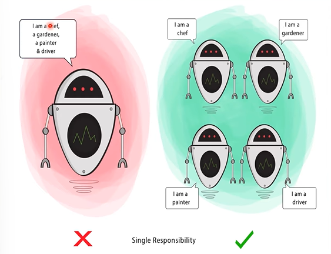
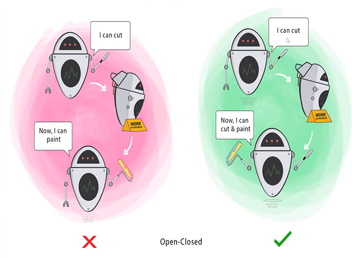
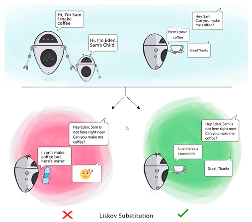
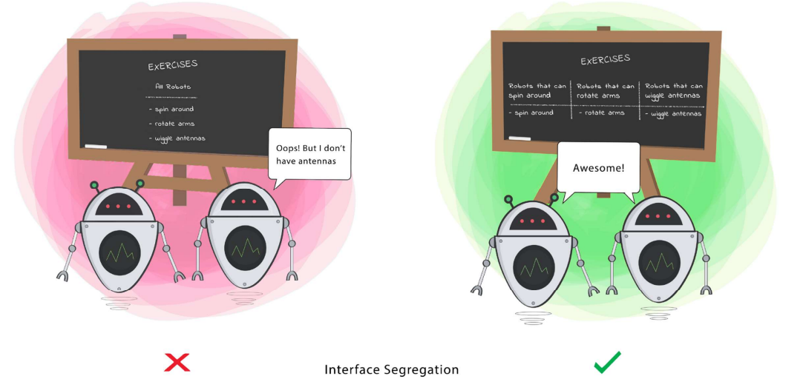
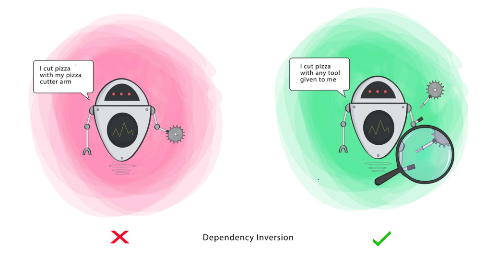
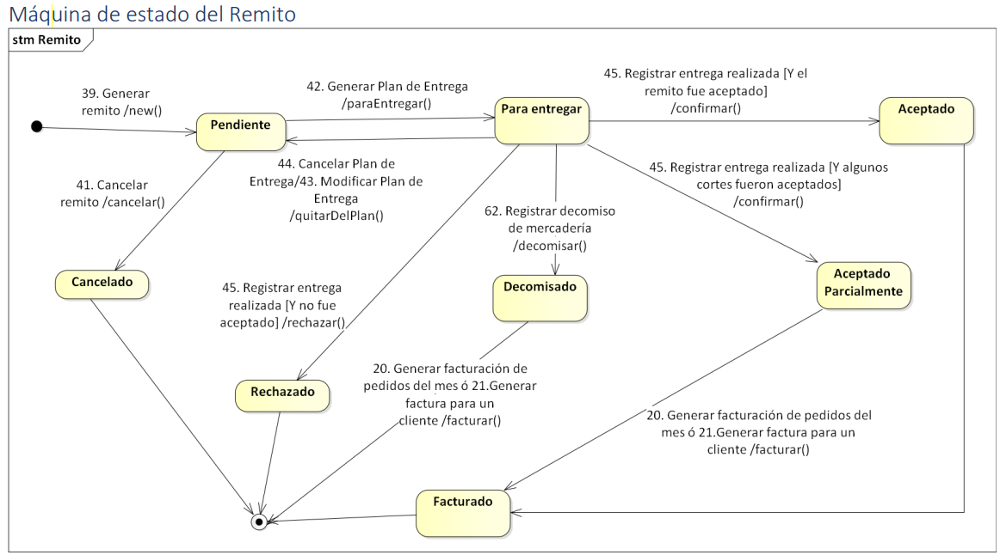
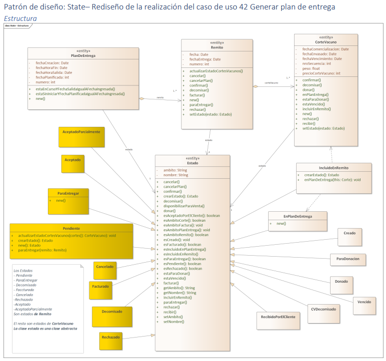
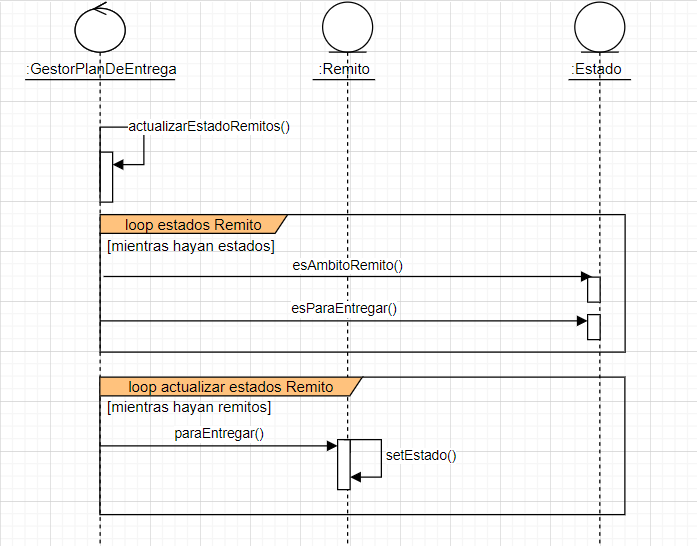
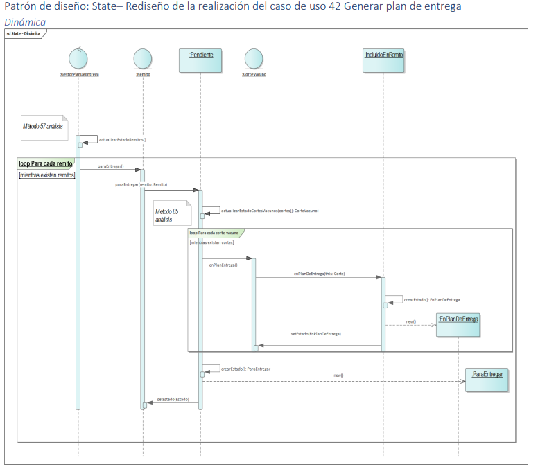

### ¿Porqué utilizamos patrones de diseño?¿A qué ayudan?
1. Encontrar objetos
2. Determinar granularidad
3. Especificar interfaces
4. Especificar implementación
5. Favorecer reutilización
6. Diseñar para el cambio

### Para lograr un *buen diseño*, se deben trabajar:
- Identificación y tratamiento de excepciones
- Independencia de componentes = Cohesión + Acomplamiento
- Prevención y tolerancia de defectos

### Principios fundamentales del diseño 
- Alta Cohesión -> Es una medida interna de relacionamiento interno del componente
- Bajo Acoplamiento -> Es una medida externa, relacionamiento externo de componentes

> Estos conceptos no sólo se tratan y trabajan para los componentes, sino que también se utilizan en todo el desarrollo general. Ayudando a tener un sistema más mantenible y ordenado.

---

### Principios de diseño para POO
> A nivel laboral estos conceptos se suelen preguntar mucho en las entrevistas
1. **SOLID**
    - **Single Responsability**:
    Apunta a que una clase debería tener una única responsabilidad global, asociado al concepto que la clase modela. *Única responsabilidad + Única razón para cambiar = Alta cohesión*
    
        > Véase ejemplo de auto e intentar realizar un ejemplo propio
    - **Open/Closed = Encapsular lo que varía**:
    Abierto para extensión, significa que la clase no se hará más grande cuando necesitamos agregarle funcionalidad, sino que se pueden crear más clases para ampliarla. *Permitir el cambio + No modificar lo existente = Flexibilidad* // *Separar lo que cambia + Ubicarlo en otra clase = Maneja la variabilidad*
    
        > Véase ejemplo de pintor e intentar realizar un ejemplo propio
    - **Liskov Sustitution**:
    Es un principio que ayuda a determinar si una herencia se encuentra bien aplicada o no. La gran pregunta es si: ***¿El hijo se comporta como el padre en caso de intercambiarlos?*** (es una prueba conceptual, en donde tomamos los métodos del padre y los aplicamos en el hijo, en caso de no funcionar, la herencia estará mal implementada). *Tipos sustituibles por sus tipos Base (clase abstracta) + Revela problemas de estructura si existieran = Herencia bien diseñada*
    
        > Véase ejemplo de persona e intentar realizar un ejemplo propio
    - **Interface Segregation**:
    Permite no romper encapsulamiento y puede implementar comportamiento de n interfaces (característica que mejora a comparación de la herencia, que no todos los lenguajes de programación permiten herencia múltiple), busca no obligar a las clases concretas a implementar comportamiento que no necesitan. Al aplicar este principio, se crean más interfaces que permiten aumentar su cohesión. *No obligar a los clientes a depender de métodos que no utilizan + No obligar a las clases a implementar interfaces que no necesitan = Bajo acoplamiento, facilidad de implementación y prueba*
    
    - **Dependecy Inversion**:
    Parte de que no está tan bueno que las capas más altas (módulos de alto nivel) dependan mucho de las inferiores (módulo de bajo nivel). Este principio invierte la relación en la herencia, en una herencia común el hijo busca del padre todos los métodos que el padre tiene definidos, en este principio se propone lo inverso, que el padre invoque/llame a un método que se encuentra en la clase hijo. Resuelve problema de dependencia, favoreciendo la cohesión y el bajo acomplamiento. *Los módulos de alto nivel no deben depender de los módulos de menor nivel + Ambos deben depender de sus abstracciones + Las abstracciones no deben depender de los detalles = Flexibilidad, robustez y movilidad*
    
        > En persistencia se ve más a fondo este tema y se aplica de forma más clara. Se lo puede conocer como *principio Hollywood "No me llames, yo te llamo"*

2. **DRY (Don't Repeat Yourself)**
Su propósito es evitar duplicaciones, si se requiere duplicar algo, creamos abstracciones en busca de esto, es decir:
*Evitar duplicaciones + Crear abstracciones = Cada requerimiento en un único lugar*

3. **SoC (Separation of Concerns)**

4. **YAGNI (You Ain't Gonna Need It)**

5. **KISS (Keep It Simple Stupid)**

5. **Principle Of Least Knowledge - Law of Demeter (Don't Talk to Strangers)**

6. **Tell, Don't Ask! (Pedir, no preguntar!)**
No está bueno que sólo la clase de control se encargue de hacer todo, y que las otras clases sólo tengan métodos de seteo/getter. Este principio va de la mano con la cohesión, busca distribuír de buena manera todos los métodos entre las clases, evitando que algunas clases sean únicamente contenedores de datos, se busca que todas las clases tengan algo para hacer. Se relaciona con el patrón experto. Se puede seguir la siguiente secuencia:
- No usar los objetos para pedirle cosas
- Decirle a los objetos que hagan cosas
- Un objeto se define por su comportamiento
- Distribución de responsabilidades
- Polimorfismo

7. **Program to Interface**

---

## Design Patterns

### Singleton
Singleton es un patrón de diseño creacional que nos permite asegurarnos de que una clase tenga una única instancia, a la vez que proporciona un punto de acceso global a dicha instancia. El problema que resuelve afecta directamente con el principio de Single Responsability (**S**OLID).

> 📝 **Nota:** Se recomienda utilizar el patrón Singleton cuando una clase de tu programa tan solo deba tener una instancia disponible para todos los clientes; por ejemplo, un único objeto de base de datos compartido por distintas partes del programa.

### Adapter

### Iterator

### Observer

### Template Method

### Strategy

### State 

#### Aplicación en caso práctico
Este patrón se aplica mirando la máquina de estados, a partir de esta podemos determinar los estados que van a formar parte del rediseño mediante este patrón, por ejemplo, en la vista de **estructura**, se formarán nuevas clases que *heredan comportamiento* de la clase abstracta *estado* (clase padre), por otro lado, para el caso de la vista dinámica con el diagrama de secuencias, es el punto que más nos puede traer dificultades, ya que debemos ver lo métodos que están instanciados en la máq de estados pero también tenemos que tener algunas consideraciones al momento de rediseñar nuestro diagrama aplicando el nuevo patrón. Este patrón también sigue el principio de programar hacia la interfaz (siendo esta mucho más reutilizable)
A continuación iremos paso a paso:

##### Diagrama de Máquina de Estados

##### Diagrama de Clases (estructura)

##### Diagrama de Secuencia (dinámico)

Como se puede observar, la primera imagen del diagrama de secuencia corresponde al primer planteo, manteniendo la clase estado como responsable de trabajar todos los estados de cada una de las otras clases (Remito y CorteVacuno), en la segunda imagen se puede observar el nuevo planteo para solucionar de una mejor manera este problema, haciendo mucho más escalable y mantenible el código, básicamente el patrón State se encarga de hacer abstracta la clase estado para que delege la responsabilidad de crear y gestionar los estados del contexto, a los estados propios que extraemos de la máquina de estados. Creamos nuevas clases con el nombre de cada estado representado en la máquina de estados. 

En este caso, se plantea en el diagrama de secuencia la implementación del patrón para la transición *del estado Pendiente hacia ParaEntregar*. Cabe aclarar que la clase estado, al ser ahora abstracta no puede aparecer en nuestro diagrama de secuencias, ya que en ningún momento se instancia (por ser abstracta), sólo se encarga de proveer comportamiento general o por defecto a las distintas clases que implementarán dichos métodos, las clases hijas también van a redefinir métodos provenientes de la padre.

### Paso a paso para ejercicios prácticos:
1. Redefinir estructura aplicando patrón
2. Redefinir comportamiento aplicando patrón
3. Explicar comportamiento modificado (con pseudocódigo)

### Tips/Comentarios de utilidad
- Generalización = Herencia
- Realización = Interfaces
- Un principio es una declaración de que algo se debe hacer de una determinada manera, los patrones en cambio, son lo que especifican más el contexto y el problema + solución.

### Bibliografía
[Refactoring Guru](https://refactoring.guru/es/design-patterns)