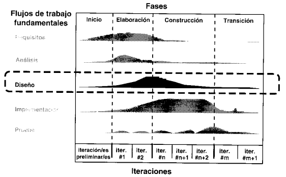

## RESUMEN DISEÑO DE SISTEMA DE INFORMACIÓN

**Ciclo de vida del Proceso Unificado de Desarrollo (PUD)**

## ¿Qué es el diseño?
--> El diseño es una etapa/framework dentro del PUD (Proceso Unificado de Desarrollo) que se encarga de recibir los RF (Requerimientos Funcionales) trabajados en la etapa/framework anterior referido al análisis, en donde estos RF fueron trabajamos sin tener en cuenta ninguna limitación a nivel de software/hardware o regla de negocio, es decir, en el análisis se asume una topología interna perfecta y neutra (la cual no le da importancia a los RNF). En el diseño, tenemos que encargarnos de resolver los RNF del sistema, llevando el modelo lógico de la etapa de análisis a un modelo físico que empieza a tener en cuenta las restricciones de negocio. 

## ¿Qué se puede diseñar?
1. Arquitectura:
    - Es la más relevante de todas, ya que marca los lineamientos y la estructura general que seguirá nuestro sistema. El diseño de la arquitectura es un conjunto de decisiones significativas que se toman para resolver los RNF (Requerimientos No Funcionales) afectando lo menos posible a los RF que llegan como entrada del framework de análisis.
2. Procesos
    - Se relaciona con patrones de diseño, para este momento no se amplía la información de este punto.
3. Experiencia de usuario
    - Relacionado con UX, todavía no profundizamos
4. Datos
    - Tiene que ver con la persistencia de los datos, de que forma se va a diseñar la transformación de POO al paradigma estructurado de las base de datos relacionales.
5. Formas de E/S 
    - Se requiere diseñar para estandarizar la forma en que ingresan datos al sistema (campos de un formulario) y las formas en que salen (reportes, estadísticas, etc)
6. Procedimientos manuales / Procesos de negocio:
    - Se relaciona a los cambios que sufre el proceso de negocio a medida que avanza la tecnología y sistemas:
        - En lote (batch)
        - En línea
        - Sistemas en tiempo real (es un tipo de sistema en línea)

        Ejemplos: Sistema en batch o lotes son las elecciones, que se recauda toda la información en papeles y luego se ingresan esos datos en el sistema, el censo es otro ejemplo, que también aplica algo más híbrido, ya que se podía censar desde nuestras propias casas, sin necesidad que pase una persona a realizar el censo.

## Profundizamos un poco en el diseño de la arquitectura...
Cada una de estas etapas tiene un rol asociado, que en este caso es el arquitecto de software, quien se encarga de desarrollar cada etapa y tiene asociadas otras responsabilidades para su rol:
    - Comunicar las decisiones tomadas al equipo
    - Negociar con los interesados o stakeholders
    - Documentar la arquitectura

El diseño de la arquitectura, se encuentra compuesto por tres etapas claves:
    1. **Determinar RNF significativos**
    2. **Diseñar la arquitectura**
        - Elegir el framework arquitectónico, básicamente es elegir los patrones arquitectónicos que nos seguirán a lo largo de todo el diseño, es lo que identificará a nuestro sistema a nivel global/general. Podemos decir como ejemplo, patrón Broker, Publish and Suscribe, Layered, Messaging, Hexagonal, las cuales explicaremos más adelante en la sección de *Patrones y estilos arquitectónicos*
        - Distribuir los componentes, en esta etapa el arquitecto, debe encargarse de dividir las responsabilidades del sistema en componentes, buscando agrupar componentes en subsistemas muy cohesivos, para que resuelvan una tarea específica, también se debe buscar un bajo acoplamiento entre componentes (para evitar que se rompa todo).
        - Vistas arquitectónicas, en este punto se deben realizar las vistas de nuestro sistema, son 10 vistas las que se pueden realizar, cada vista representa una forma de modelar la arquitectura, la sumatoria de todas nos permitirán tener un entendimiento mucho mejor de la arquitectura, esta parte debe ir en el documento  de arquitectura.
    3. **Validar la arquitectura**
        - Escenarios de prueba, son artefactos simples, que se utilizan para validar algún comportamiento de la arquitectura frente a algún evento/estímulo particular que pueden tener un gran impacto en la misma.
        - Ejemplos:
        
        - Prototipos, muchas veces sucede, que los escenarios se tornan un poco más complejos, por lo tanto, se requiere la realización de un mini prototipo, para poder validar el comportamiento de la arquitectura, se desarrolla una aplicación pequeña (una versión mínima) encargada de realizar un aspectos particular de nuestro sistema. Estos prototipos nos deben ayudar a responder alguna de estas dos preguntas:
            1. Prueba de conceptos: ¿Puede la arquitectura como fue diseñada ser construida de manera tal que satisfaga los requerimientos?
            2. Prueba de tecnología:  ¿La tecnología elegida (middleware, aplicaciones integradas, librerías, etc.) para implementar la arquitectura se comporta como es esperado?

*Sección preguntas:*
- ¿Por qué es importante diseñar la arquitectura del software?
- ¿Cómo se documenta la arquitectura del software?
- ¿En qué momento del ciclo de vida se diseña la arquitectura