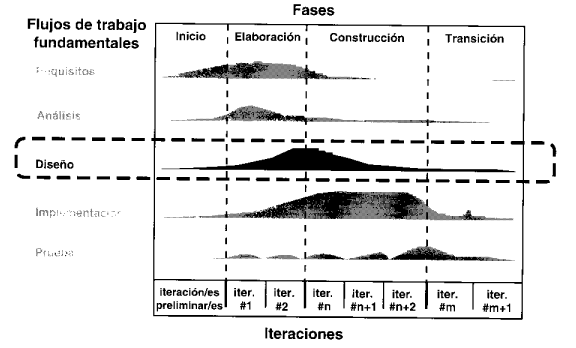
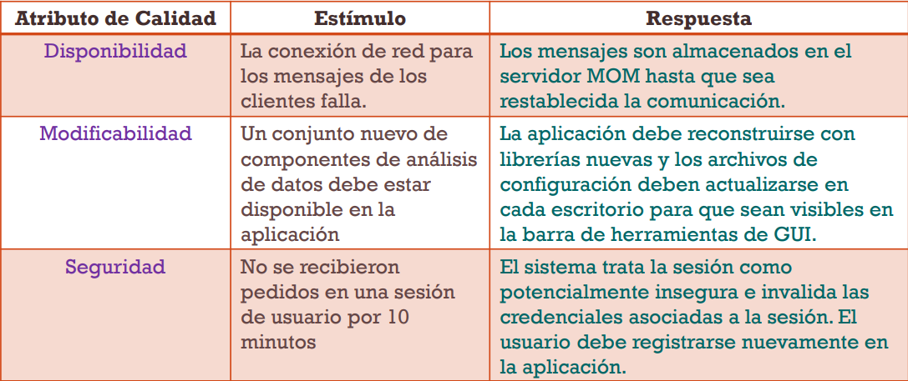
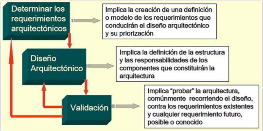
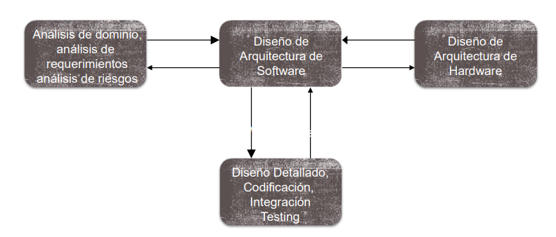
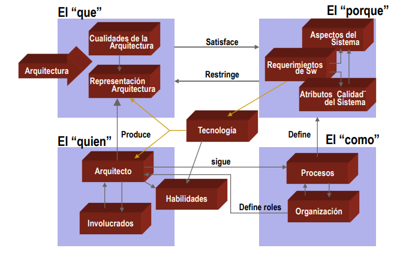
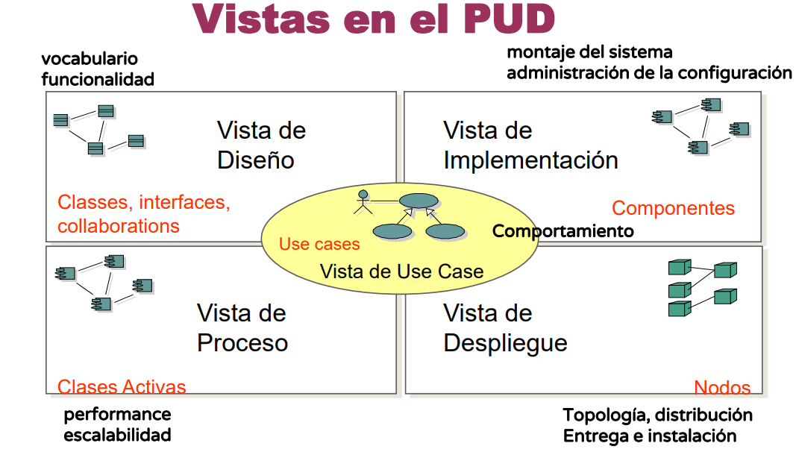
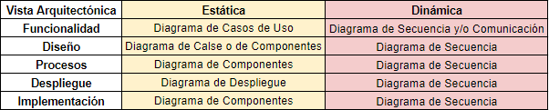
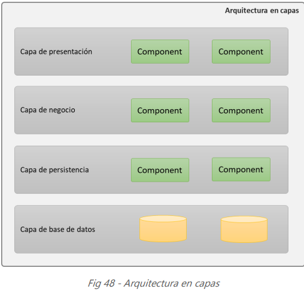
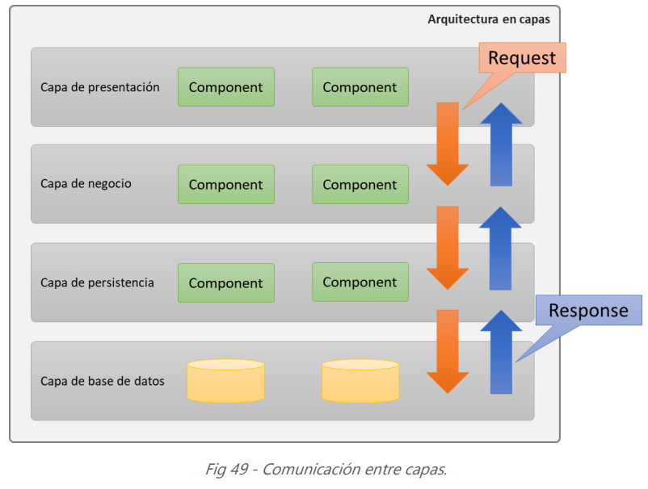

## RESUMEN DISEÑO DE SISTEMA DE INFORMACIÓN

**Ciclo de vida del Proceso Unificado de Desarrollo (PUD)**

Pilares del PUD:
1. Dirigido por Casos de Uso
2. Centrado en la Arquitectura
3. Proceso Iterativo e Incremental

## ¿Qué es el diseño?
El diseño es una etapa/framework dentro del PUD (Proceso Unificado de Desarrollo) que se encarga de recibir los RF (Requerimientos Funcionales) trabajados en la etapa/framework anterior referido al análisis, en donde estos RF fueron trabajamos sin tener en cuenta ninguna limitación a nivel de software/hardware o regla de negocio, es decir, en el análisis se asume una topología interna perfecta y neutra (la cual no le da importancia a los RNF). En el diseño, tenemos que encargarnos de resolver los RNF del sistema, llevando el modelo lógico de la etapa de análisis a un modelo físico que empieza a tener en cuenta las restricciones de negocio. 

## ¿Qué se puede diseñar?
1. **Arquitectura**:
    - Es la más relevante de todas, ya que marca los lineamientos y la estructura general que seguirá nuestro sistema. El diseño de la arquitectura es un **proceso** que conlleva un conjunto de decisiones significativas que se toman para resolver los RNF (Requerimientos No Funcionales) afectando lo menos posible a los RF que llegan como entrada del framework de análisis.
2. **Procesos**
    - Se relaciona con patrones de diseño, para este momento no se amplía la información de este punto.
3. **Experiencia de usuario**
    - Relacionado con UX, todavía no profundizamos
4. **Datos**
    - Tiene que ver con la persistencia de los datos, de que forma se va a diseñar la transformación de POO al paradigma estructurado de las base de datos relacionales.
5. **Formas de E/S** 
    - Se requiere diseñar para estandarizar la forma en que ingresan datos al sistema (campos de un formulario) y las formas en que salen (reportes, estadísticas, etc)
6. **Procedimientos manuales / Procesos de negocio**
    - Se relaciona a los cambios que sufre el proceso de negocio a medida que avanza la tecnología y sistemas:
        - En lote (batch)
        - En línea
        - Sistemas en tiempo real (es un tipo de sistema en línea)

        Ejemplos: Sistema en batch o lotes son las elecciones, que se recauda toda la información en papeles y luego se ingresan esos datos en el sistema, el censo es otro ejemplo, que también aplica algo más híbrido, ya que se podía censar desde nuestras propias casas, sin necesidad que pase una persona a realizar el censo.

## Profundizamos un poco en el diseño de la arquitectura...
- Cada una de estas etapas tiene un rol asociado, que en este caso es el arquitecto de software, quien se encarga de desarrollar cada etapa y tiene asociadas responsabilidades:
    - Comunicar las decisiones tomadas al equipo
    - Negociar con los interesados o stakeholders
    - Documentar la arquitectura
    - Comunica la arquitectura, asegurando que los interesados la comprendan.
    - Direcciona los requerimientos no funcionales a la arquitectura.
    - Configura la arquitectura de hardware.
    - Se asegura que la arquitectura es respetada.
    - Trabaja con el Administrador del Proyecto (jefe o líder de proyecto), ayudando en la planificación, la  estimación, la distribución de las tareas y la calendarización del proyecto (organiza recursos, cumplir presupuestos, cumplir costos y tiempos).
El arquitecto es el trabajador en los 3 primeros workflows: requerimientos, análisis y diseño. Es una figura reciente en la 
ingeniería de software. También suele llamarse líder técnico. Tiene que tener muchas habilidades y capacidades, es un rol 
que se logra con el tiempo. Suelen ser desarrolladores con un perfil técnico que evolucionan. El rol del arquitecto suele ser 
colegiado (ejercido por más de una persona) ya que hay que saber un poco de todo. Los arquitectos deben poseer 
múltiples habilidades de software, ingeniería, tecnología, gestión y comunicaciones

- El diseño de la arquitectura, se encuentra compuesto por tres etapas claves:
    1. **Determinar RNF significativos**
    2. **Diseñar la arquitectura**
        - Elegir el framework arquitectónico, básicamente es elegir los patrones arquitectónicos que nos seguirán a lo largo de todo el diseño, es lo que identificará a nuestro sistema a nivel global/general. Podemos decir como ejemplo, patrón Broker, Publish and Suscribe, Layered, Messaging, Hexagonal, las cuales explicaremos más adelante en la sección de *Patrones y estilos arquitectónicos*
        - Distribuir los componentes, en esta etapa el arquitecto, debe encargarse de dividir las responsabilidades del sistema en componentes, buscando agrupar componentes en subsistemas muy cohesivos, para que resuelvan una tarea específica, también se debe buscar un bajo acoplamiento entre componentes (para evitar que se rompa todo). De aquí salen las vistas arquitectónicas, son 10 vistas las que se pueden realizar, cada vista representa una forma de modelar la arquitectura, la sumatoria de todas nos permitirán tener un entendimiento mucho mejor de la arquitectura, esta parte debe ir en el documento de arquitectura.
    3. **Validar la arquitectura**
        - Escenarios de prueba, son artefactos simples, que se utilizan para validar algún comportamiento de la arquitectura frente a algún evento/estímulo particular que pueden tener un gran impacto en la misma.
        - Ejemplos:
        
        - Prototipos, muchas veces sucede, que los escenarios se tornan un poco más complejos, por lo tanto, se requiere la realización de un mini prototipo, para poder validar el comportamiento de la arquitectura, se desarrolla una aplicación pequeña (una versión mínima) encargada de realizar un aspectos particular de nuestro sistema. Estos prototipos nos deben ayudar a responder alguna de estas dos preguntas:
            1. Prueba de conceptos: ¿Puede la arquitectura como fue diseñada ser construida de manera tal que satisfaga los requerimientos?
            2. Prueba de tecnología:  ¿La tecnología elegida (middleware, aplicaciones integradas, librerías, etc.) para implementar la arquitectura se comporta como es esperado?

            

## La arquitectura en contexto

## RNF Críticos (atributos de calidad observables):
- Performance
- Seguridad
- Usabilidad
- Funcionalidad
- Disponibilidad

## No observables:
- Modificabilidad
- Portabilidad
- Reusabilidad
- Testeabilidad
- Escalabilidad

Utilizar componentes de granularidad alta, mejora la performance, pero reduce la mantenibilidad del sistema. Por otro lado la introducción de datoa redundantes mejora la disponibilidad pero hace la seguridad más dificil. Y por último, la localización de aspectos de seguridad, significa más comunicación y un deterioro de la performance.

## Razones por la cual documentar la arquitectura
- Dejar plasmado decisiones importantes
- Justificación de framework y patrones utilizados
- Cómo se da respuesta y prioridad a los RNF elegidos
- Reutilización a gran escala
- Ver con claridad qué prioridad tienen los RNF

## Problemas al documentar...
- No existe un estándar de documentación de arquitectura universalmente aceptado.
- Una arquitectura puede ser compleja y documentarla de forma comprensible es lenta y no trivial.

## Qué documentar?

Necesidades de las partes interesadas de la aplicación: La documentación de la arquitectura sirve para comunicaciones importantes. En un equipo pequeño, la comunicación interpersonal a menudo es buena, por lo que la documentación puede ser mínima.

La documentación requiere tiempo para desarrollarse y cuesta dinero. Por tanto, es importante pensar detenidamente qué documentación será más útil dentro del contexto del proyecto, de producir y mantener esto como documentos de referencia clave para el proyecto.

## Ventajas de diseñar y documentar la arquitectura
1. Comunicación con los involucrados: la arquitectura es una presentación que sirve para usarse como 
enfoque para la discusión de un amplio número de participantes.
2. Análisis del sistema: sirve para aclarar la arquitectura del sistema, para saber si se cumplen los 
requerimientos críticos.
3. Reutilización a gran escala: es posible desarrollar arquitecturas de línea de productos donde la misma 
arquitectura se reutilice mediante una amplia gama de sistemas relacionados.

## Conflictos arquitectónicos
1. Utilizar componentes de granularidad gruesa mejora la performance pero reduce la mantenibilidad. (gana la performance)
2. La introducción de datos redundantes mejora la disponibilidad pero hace más difícil la seguridad. (y la performance) Hay más lugares en donde se necesita controlar la seguridad y se tienen que agregar más capas de validación, esto hace que la performance se degrade, siendo más lento el sistema. 
3. La localización de aspectos de seguridad relacionados usualmente significa más comunicación, por lo tanto degrada la performance.

## Vistas Arquitectónicas
Las vistas arquitectónicas son formas de modelar la arquitectura del software, dentro del contexto del PUD, se toma como convención el enfoque de vistas arquitectónicas 4 + 1, estas 4 vistas están unidas por otra que es la vista de funcionalidad (casos de uso) la cual contiene los casos de uso significativos para la arquitectura. Se describirán a continuación:

1. **Vista de Diseño (lógica)**, describe los elementos significativos de la arquitectura  y las relaciones entre ellos. Esta vista se diseña para el usuario final, es quien utilizará el sistema, para que pueda entender la arquitectura desde un punto de vista más sencillo. Describe cómo será provista la funcionalidad del sistema, qué clases, objetos o componentes voy a utilizar para dar soporte a la funcionalidad.
2. **Vista de Proceso**, se centra en describir la concurrencia y elementos de comunicación del sistema, se encuentra más relacionado con la performance.
3. **Vista de Despliegue (física)**, esta vista describe cómo los principales procesos y componentes se asignan al hardware de 
las aplicaciones. Muestra cómo el software será alojado en los diferentes componentes de hardware. Podría mostrar, por ejemplo, cómo se distribuye la base de datos y los servidores web de una aplicación en varias máquinas servidor.
4. **Vista Implementación (componentes)**, : Esto captura la organización interna de los componentes de código, normalmente cuando se mantienen en un entorno de desarrollo o herramienta de gestión de la configuración. Describe también las dependencias de los módulos de implementación (código fuente, bibliotecas, componentes de terceros).
5. **+1 Vista funcionalidad o de escenarios**, representa los casos de uso significativos para la arquitectura. 

Las vistas que utilizamos en el práctico son:
- Vista arquitectónica de funcionalidad - Diagrama de Casos de Uso
- Vista arquitectónica de diseño - Diagrama de Componentes
- Vista arquitectónica de despliegue - Diagrama de Despliegue

Cada vista tiene a su derecha el diagrama UML relacionado

Cabe aclarar que son 10 vistas en total las que se pueden modelar para la arquitectura, sólo vemos 3 y son estáticas en la parte práctica de la materia, pero en el cuadro de arriba podemos observar las 10, con su parte estática y dinámica. Aclaramos que todas las vistas se construyen en el workflow (WF) de diseño, menos la vista de funcionalidad estática que corresponde al WF de requerimientos y la dinámica que corresponde al WF de análisis.

Ahora nos preguntamos, ¿hace falta construir todas las vistas?, ¿hacen falta más vistas?
Las vistas son modelos simplificados para mostrar el contexto. No todos los sistemas requieren todas las vistas. Por ejemplo si tenemos:
- Un solo procesador: saltear la vista de despliegue.
- Procesos simples: saltear la vista de procesos.
- Programas muy pequeños: saltear la vista de implementación

*Sección preguntas:*
- ¿Por qué es importante diseñar la arquitectura del software?
- ¿Cómo se documenta la arquitectura del software?
- ¿En qué momento del ciclo de vida se diseña la arquitectura?
- Grafique y explique el proceso de diseño de la arquitectura del software que propone el autor Ian Gorton.
- Explique por qué se utilizan vistas para modelar la arquitectura, qué vistas se utilizan y qué diagramas de UML se emplean para modelar en cada vista.

## Tipos de sistemas
- Personales
- Distribuidos --> Son los que ameritan nuestro estudio
- Embebidos

## Sistemas distribuidos
Este tipo de sistemas, se caracteriza por tener un procesamiento distribuido en varias computadoras/servidores de la información. Este sistema se ejecuta gracias a la coparticipación de muchas computadoras, que permiten que el usuario vea al final, un sistema coherente y unido, sin saber ni tener en cuenta que el procesamiento se ejecuta en varios lugares. Estos sistemas deben ser transparentes, refiere a que el sistema se vea como uno sólo (un poco lo que veníamos hablando anteriormente), en la práctica es imposible debido a demoras en la red, fallas en los nodos/servers, etc.

Características:

Desventajas:

Ataques a defender:

Falacias:

## Patrones Arquitectónicos

1. Arquitectura monolítica

2. Layered

- Este patrón permite dar una estructura (no es dinámico) de nuestro sistema consta de dividir los componentes en capas, buscando una alta cohesión y bajo acoplamiento de las mismas, una características que disminuye su acoplamiento, es que las capas sólo puede comunicarse entre las capas adyacentes, es decir, la comunicación que puedo hacer entre la capa de presentación y de persistencia, no puede ser directa, sino que debo recorrer primero la de logica de negocio, para que luego esta obtenga lo que necesito y se lo disponibilice a la de presentación. La separación en capas busca cumplir con el principio de separación de preocupación o más bien conocido "no hables con extraños", de tal forma que cada capa se encarga de una tarea específica.
A este patrón también lo identifica algo muy importante, que es el aislamiento de capas, esto refiere a que al realizar un cambio, este cambio, no debería afectar a la otras capas de nuestro sistema
1. **Capa de presentación**: Es la encargada de crear la vista o interface gráfica de usuario, puede ser una aplicación web, una app de escritorio o una app móvil. Generalmente escrito en HTML, Javascript, CSS, Android/Swift, etc.
2. **Capa de lógica de negocio**: Esta capa contiene la lógica de negocio y las operaciones de alto nivel que la capa de presentación puede utilizar. Generalmente escrito en Java, Python, .NET, NodeJS, etc.
3. **Capa de acceso a datos**: Esta capa corresponde a la capa donde están los datos, por ejemplo, MySQL, Oracle, PostgreSQL, MongoDB, etc

Características:
- Las capas de la aplicación son totalmente independientes de las demás, con la excepción de la capa que está inmediatamente debajo.
- Deben de existir al menos 3 capas para considerar una aplicación por capas.
- Toda la comunicación se hace siempre de forma descendente, pasando desde las capas superiores a las más inferiores
- Aislamiento de capas
- Principio de separación de responsabilidad

Ventajas y desventajas:
Los sistemas que siguen este patrón arquitectónico suelen ser **fáciles de desarrollar**, ya que es una arquitectura muy conocida y difundida, lo cual hace que la curva de desarrollo y aprendizaje de la misma, sea menor, a una de tipo microservicios, también son **fáciles de testear** ya que se pueden probar las capas de forma independiente, sin necesidad de correr todo el sistema para probarlo, es tan simple como ejecutar y probar la capa interesada. Por otro lado una ventaja considerable, es el bajo acoplamiento que aporta esta arquitectura, ya que sigue el principio de 'no hables con extraños' o **'separación de responsabilidades'** que indica que cada capa se comunica sólo con la adyacente y se encarga de realizar una tarea bien definida y particular, el gran desafío también se encuentra en lograr separar de forma correcta e intentando hacer lo más cohesivo posible las capas. Implementa **seguridad**, al separarse por capas y tener una forma particular de comunicarse entre ellas, se implementa indirectamente seguridad, por ejemplo, la capa de presentación no puede comunicarse directamente con la capa de datos sin pasar antes por las otras dos que tiene debajo.
Algunas de las contras que presenta, es al momento de la ejecución del sistema, este puedo tener problemas relacionados a la **performance y disponibilidad** ante la caída o la falla de conexión en alguno de los servidores o la red de wifi o conexión utilizada, recordemos que cada capa va a deployarse en un servidor particular, y estos servidores a su vez, se comunican mediante peticiones HTTP y de red para obtener la información solicitada entre cada capa. El **despliegue** de la aplicación se torna un tanto complicado, ya que se requiere deployar de abajo hacia arriba, esto se debe a que cada capa le solicita información a la capa adyacente que tiene debajo de ella, esto también provoca que **no sea tolerante a los fallos**, ya que si falla una capa inferior, todas las superiores también van a a fallar, debido a que dependen de los servicios que la capa de abajo les provee. Y por último la **escalabilidad** también es un factor que juega en contra, ya que a medida que crece la aplicación, tiende a ser más monolítica y ser todo un bloque de procesamiento, que si se cae una parte, se cae todo el procesamiento y por consecuencia el sistema.

*Sección preguntas:*
- Elija tres patrones arquitectónicos asociados a la vista de ejecución (runtime), y para cada uno de ellos explique su propósito y elija un caso para ejemplificar donde se justifica su aplicación.
- Realizar para cada patrón arquitectónico, un cuadro con las sigientes filas: Descripción - Cuando se usa - Ventajas - Desventajas

## Arquitectura Microservicios vs Monolíticos

## Patrones de microservicios

1. Descomposición del problema en dominios
2. Una base de datos por cada Servicio
3. API Gateway
4. 
5. 
6. 